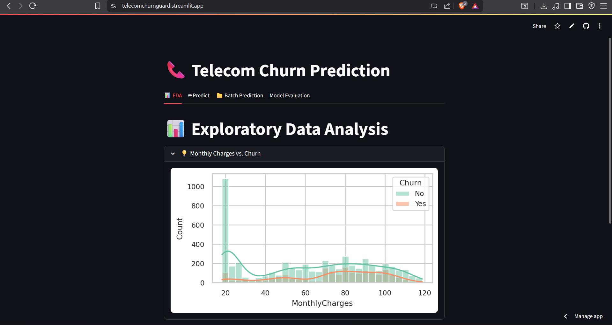
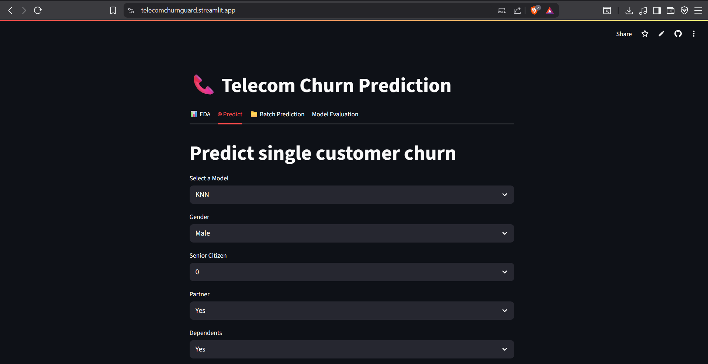
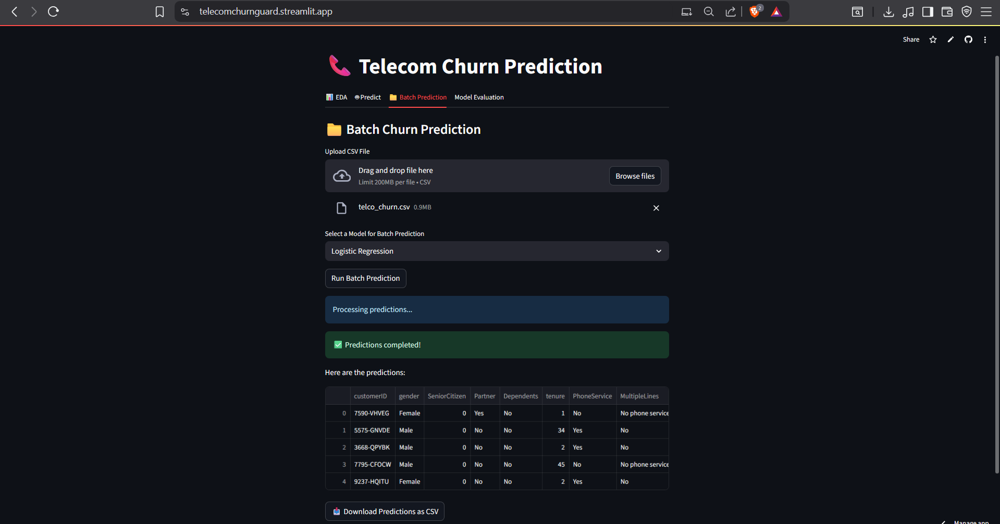

# 📡 ChurnGuard: A Telecom Customer Retention Predictor

**The Telecom Churn Prediction project demonstrates a reproducible ML workflow for identifying customers at risk of leaving a telecom provider.**  
The pipeline begins with thorough preprocessing of the Telco dataset (coercing `TotalCharges`, mapping binary fields, generating dummies for multi-class features, and standardizing numeric columns), and then trains several classical models — **KNN, Logistic Regression, SVM, and XGBoost** — saving the best artifacts to `models/trained/`.

A lightweight **Streamlit UI** provides three tabs for:
- Exploratory Data Analysis (EDA)
- Single customer inference
- Batch inference via CSV upload

The app uses the exact saved preprocessor to guarantee consistent predictions in production.  
This project is designed for clarity and extensibility: models and preprocessing are decoupled, evaluation plots are included, and the repository structure makes it easy to add new models and explainability.

---

## 🚀 Getting Started

Follow these steps to run the Telecom Churn Prediction project locally.

### 1️⃣ Clone the Repository
```bash
git clone https://github.com/AdityaMVerma/ChurnGuard.git
```

### 2️⃣ Install Dependencies
```bash
pip install -r requirements.txt
```

### 3️⃣ Prepare the Data
Place the raw dataset inside:
```
data/raw/telcochurn.csv
```
The preprocessing script will generate:
```
data/processed/processed_telco_churn.csv
```

### 4️⃣ Train the Models
Run the model training once in the `preprocess.py` section, then comment it out to avoid retraining each time. Save the best model as `.pkl` in:
```
models/trained/model_name.pkl
```

Example:
```python
from ../../models/scripts/LR import train_logistic_regression
lr_model = train_logistic_regression(X_train, y_train, X_test, y_test)

from ../../models/scripts/KNN import train_knn_model
knn_model = train_knn_model(X_train, y_train, X_test, y_test)

from ../../models/scripts/SVM import train_svm_model
svm_model = train_svm_model(X_train, y_train, X_test, y_test)

from ../../models/scripts/XGBOOST import train_xgboost_model
xgb_model = train_xgboost_model(X_train, y_train, X_test, y_test)

python src/evaluation/evaluate_models.py
```

### 5️⃣ Run the Streamlit App
```bash
streamlit run app.py
```
Then open the link in your terminal (usually `http://localhost:8501`) in your browser.

---

## ⚙️ Data Preprocessing (`src/preprocessing/preprocess.py`)

The preprocessing pipeline ensures that raw telecom data is clean, encoded, and scaled before training or inference.

**Key steps:**

### 1. Read the raw data
```python
import pandas as pd
df = pd.read_csv('../../data/telco_churn.csv')
```

### 2. Handle missing values
`TotalCharges` is coerced to numeric, invalid entries become `NaN`, and missing values are imputed with the median.
```python
df['TotalCharges'] = pd.to_numeric(df['TotalCharges'], errors='coerce')
df['TotalCharges'].fillna(df['TotalCharges'].median(), inplace=True)
```

### 3. Encode categorical features
Binary columns → mapped to 0/1.  
Multi-class columns → one-hot encoded.
```python
binary_map = {'Yes': 1, 'No': 0}
df['Partner'] = df['Partner'].map(binary_map)
df = pd.get_dummies(df, drop_first=True)
```

### 4. Feature scaling
Standardizes numeric features for models sensitive to scale:
```python
from sklearn.preprocessing import StandardScaler
scaler = StandardScaler()
df[numeric_cols] = scaler.fit_transform(df[numeric_cols])
```

### 5. Split & save data
```python
df.to_csv('../../data/processed/processed_telco_churn.csv', index=False)
X_train, X_test, y_train, y_test = train_test_split(X, y,
    test_size=0.2, random_state=42, stratify=y)
joblib.dump((X_test, y_test), "../../models/trained/test_data.pkl")

joblib.dump({
    "columns": X_train.columns.tolist(),
    "scaler": scaler
}, "../../models/trained/preprocessor.pkl")
```

---

## 🛠️ Model Training

Each ML model is implemented in its own script inside `models/scripts/`:

- `knn.py` – K-Nearest Neighbors  
- `logistic_regression.py` – Logistic Regression  
- `svm.py` – Support Vector Machine  
- `xgboost.py` – XGBoost Classifier  

Each script:
1. Loads processed data from `data/processed/processed_telco_churn.csv`
2. Trains on the training set
3. Saves model as `.pkl` in `models/trained/`

---

## 📊 Model Evaluation

Handled in `src/evaluation/evaluate_models.py`.

**Steps:**
- Load `test_data.pkl`  
- Load each `.pkl` trained model  
- Generate predictions  
- Calculate **accuracy, precision, recall, F1-score**  
- Compare results in a summary table  

---

## 💻 Streamlit Web Application (`app.py`)

Four tabs:

<h3>📊 Exploratory Data Analysis</h3>


- 📊 Monthly Charges vs Churn – `histplot`
- 📈 Tenure Distribution by Churn – `kdeplot`
- 📬 Churn by Payment Method – `countplot`
- 📞 Phone vs Internet Service – `countplot`
- 📊 Churn Rate by Contract Type – stacked bar chart


<h3>🧍 Single Prediction</h3>


- Implemented in `src/prediction/predict.py`
- Loads best model + preprocessor  
- Accepts inputs via UI or code  
- Returns churn status + probability

<h3>📦 Batch Prediction</h3>

- Implemented in `src/prediction/predict_batch.py`
- Accepts CSV upload
- Applies preprocessing
- Outputs predictions & optional CSV export

<h3>📈 Model Evaluation</h3>


